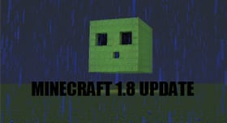

# 🎮 Budsin Games

<p align="center">
  
  
  
  
  
</p>

<p align="center">
  Portal de juegos en navegador con experiencia tipo consola 🎮  
</p>

---

## 🚀 Demo

🔗 https://budsin-games.pages.dev

---

## 🧠 Sobre el proyecto

**Budsin Games** es una plataforma web de juegos accesibles directamente desde el navegador.
Inspirada en interfaces de consola (como Nintendo Switch), prioriza velocidad, diseño visual y facilidad de uso.

---

## ✨ Features

* 🎮 **39 juegos jugables al instante**
* ⚡ **Sin descargas ni instalación**
* 🧩 **UI tipo consola (portadas interactivas)**
* ⭐ **Sistema de favoritos (localStorage)**
* 📊 **Ranking de popularidad con Firebase**
* 🧠 **Filtros por categorías**
* 🔍 **Búsqueda en tiempo real**
* 🌐 **Soporte multilenguaje (ES / EN)**
* ⚙️ **Ajustes para URL de Classroom Hotkey (guardado local)**

---

## 🗂️ Categorías

* ⚔️ Acción
* 💤 Idle / Clicker
* 🌐 Multiplayer
* 🧱 Clásicos

---

## 🎯 Catálogo completo (39 juegos)

| Juego                          | Categoría   |
| ------------------------------ | ----------- |
| Minecraft 1.12.2               | Acción      |
| Minecraft 1.8                  | Multiplayer |
| Minecraft 1.21.x               | Acción      |
| Cookie Clicker                 | Idle        |
| Cookie Clicker Legacy Edition  | Idle        |
| Bitcoin Clicker                | Idle        |
| Geometry Dash                  | Acción      |
| Hollow Knight                  | Acción      |
| Eggy Car                       | Acción      |
| Level Devil                    | Acción      |
| Drive Mad                      | Acción      |
| Stickman Hook                  | Acción      |
| SuperHot                       | Acción      |
| Vex 7                          | Acción      |
| Recoil                         | Acción      |
| Among Us                       | Multiplayer |
| Fireboy And Watergirl 1        | Multiplayer |
| Smash Karts                    | Multiplayer |
| Rocket Goal                    | Multiplayer |
| Friday Night Funkin            | Clásicos    |
| Subway Surfers                 | Clásicos    |
| Red Ball                       | Clásicos    |
| Snow Rider                     | Clásicos    |
| Stacktris                      | Clásicos    |
| UNDERTALE                      | Clásicos    |
| We Become What We Behold       | Clásicos    |
| Super Mario 64                 | Clásicos    |
| Super Mario Bros               | Clásicos    |
| Super Mario World              | Clásicos    |
| Pac-Man                        | Clásicos    |
| Galaga                         | Clásicos    |
| Centipede Arcade               | Clásicos    |
| Half-Life                      | Clásicos    |
| Cooking Mama                   | Clásicos    |
| Cooking Mama 2                 | Clásicos    |
| Cooking Mama 3                 | Clásicos    |
| RubDy                          | Clásicos    |
| Soundboard                     | Clásicos    |
| Budsin AI                      | Clásicos    |

---

## 📸 Preview

<p align="center">
  
</p>

---

## 🛠️ Tech Stack

* HTML5
* CSS3
* JavaScript (Vanilla)
* Firebase (conteo de popularidad, sin Auth)
* Cloudflare Pages

---

## 📁 Estructura del Proyecto

```bash
/
├── README.md
├── AGENTS.md
├── .firebaserc
├── firebase.json
└── public/
    ├── index.html
    ├── 404.html
    ├── settings.html
    ├── [juego].html          ← Páginas de cada juego (estructura plana)
    ├── Funkin-HTML-Port-main/  ← Friday Night Funkin (port completo)
    ├── cookie/               ← Cookie Clicker (port completo)
    ├── fonts/
    ├── images/
    ├── lang/
    ├── lib/
    ├── scripts/
    ├── stylesheets/
    └── [portadas].jpg/jpeg/webp/avif/png/svg
```

> ⚠️ **Regla de estructura**: Todo juego vive en `public/[nombre-del-juego]` (archivo `.html` o subcarpeta).
> No se usa la carpeta `/games`.

---

## ⭐ Favoritos

Los usuarios pueden marcar juegos como favoritos ⭐
Estos se almacenan localmente usando:

```js
localStorage.setItem("budsin_favorites", JSON.stringify([...]))
```

---

## 📊 Ranking de Popularidad

Sistema de "Más jugados" integrado con Firebase Firestore.

* Conteo atómico de clics por juego
* Ranking dinámico en tiempo real
* Sin Login ni Auth — solo contadores anónimos
* Colección Firebase: `game_popularity`

---

## 🔧 Instalación local

```bash
git clone https://github.com/tu-usuario/budsin-games.git
cd budsin-games/public
```

Abrir en navegador:

```bash
index.html
```

---

## 🧪 Desarrollo

Proyecto **100% frontend**, sin backend requerido para uso básico.
Firebase se usa únicamente para el conteo de popularidad.

---

## 📝 Changelog

### v4.5
* Se agregó **Budsin AI** al portal con portada `ai.jpeg`, acceso directo desde el index e integración al sistema de ranking/popularidad.

### v4.3.0
* Se agregaron **RubDy, Super Mario Bros, Pac-Man, Super Mario World, Galaga y Centipede Arcade** al catálogo del portal.
* Las nuevas entradas se integraron al **index** y al sistema de **ranking/popularidad**.
* El changelog del portal ahora se muestra como **v4.3.0** y no puede cerrarse hasta después de 5 segundos.

---

## 💡 Roadmap

* 🔍 Buscador avanzado de juegos
* 📊 Ranking público visible
* 👤 Sistema de cuentas (opcional)
* 🏆 Leaderboards
* 💾 Guardado de progreso en la nube
* 🎮 Más juegos

---

## ⚠️ Disclaimer

Este proyecto actúa como portal de acceso a juegos web.
Todos los juegos pertenecen a sus respectivos creadores.

---

## 👨‍💻 Autor

**Budsin**
🚀 Creador de Budsin Games

---

## 🤝 Contribuciones

¿Ideas o mejoras?
👉 [Aquí](https://forms.gle/bUHTy8Lt6Kz1qkAx8)

---

## ⭐ Support

Si te gusta el proyecto, dale una estrella ⭐ en GitHub

---

## 📌 Estado

🟢 Activo — En desarrollo constante